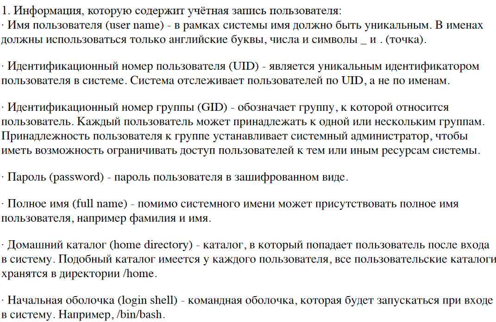
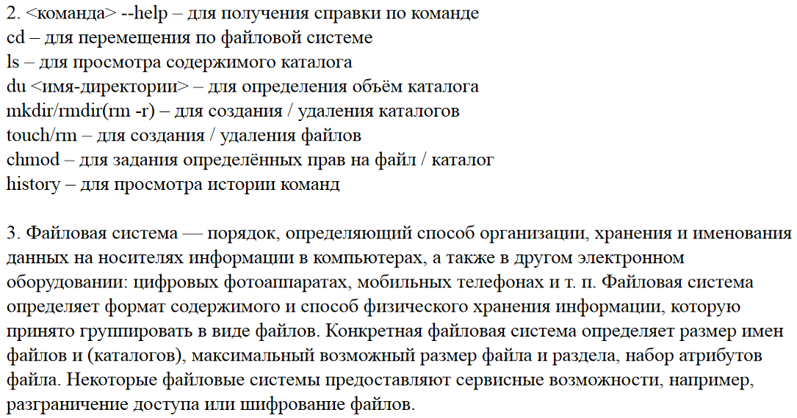

---
## Front matter
title: "Лабораторная работа №1"
subtitle: "Установка и конфигурация операционной системы на виртуальную машину"
author: "Мальсагов Мухаммад Абу-Бакарович"

## Generic otions
lang: ru-RU
toc-title: "Содержание"

## Bibliography
bibliography: bib/cite.bib
csl: pandoc/csl/gost-r-7-0-5-2008-numeric.csl

## Pdf output format
toc: true # Table of contents
toc-depth: 2
lof: true # List of figures
lot: true # List of tables
fontsize: 12pt
linestretch: 1.5
papersize: a4
documentclass: scrreprt
## I18n polyglossia
polyglossia-lang:
  name: russian
  options:
	- spelling=modern
	- babelshorthands=true
polyglossia-otherlangs:
  name: english
## I18n babel
babel-lang: russian
babel-otherlangs: english
## Fonts
mainfont: PT Serif
romanfont: PT Serif
sansfont: PT Sans
monofont: PT Mono
mainfontoptions: Ligatures=TeX
romanfontoptions: Ligatures=TeX
sansfontoptions: Ligatures=TeX,Scale=MatchLowercase
monofontoptions: Scale=MatchLowercase,Scale=0.9
## Biblatex
biblatex: true
biblio-style: "gost-numeric"
biblatexoptions:
  - parentracker=true
  - backend=biber
  - hyperref=auto
  - language=auto
  - autolang=other*
  - citestyle=gost-numeric
## Pandoc-crossref LaTeX customization
figureTitle: "Рис."
tableTitle: "Таблица"
listingTitle: "Листинг"
lofTitle: "Список иллюстраций"
lotTitle: "Список таблиц"
lolTitle: "Листинги"
## Misc options
indent: true
header-includes:
  - \usepackage{indentfirst}
  - \usepackage{float} # keep figures where there are in the text
  - \floatplacement{figure}{H} # keep figures where there are in the text
---

# Цель работы

Приобретение практических навыков установки операционной системы на виртуальную машину, настройки минимально необходимых для дальнейшей работы сервисов. 

# Выполнение лабораторной работы

При установке виртуальной машины у меня возникли некоторые проблемы, которые я не смог решить. Поэтому я установил вторую операционную систему Fedora рядом с windows, указал имя пользователя и пароль при первом запуске без записи. Далее я указал имя хоста.(рис. [-@fig:001])

{ #fig:001 width=70% }

Домашнее задание:

1. В окне терминала проанализируйте последовательность загрузки системы.(рис. [-@fig:002])

{ #fig:002 width=70% }

2. Получите следующую информацию.
    1. Версия ядра Linux (Linux version).
    2. Частота процессора (Detected Mhz processor).
    3. Модель процессора (CPU0).
    4. Объем доступной оперативной памяти (Memory available).
    5. Тип обнаруженного гипервизора (Hypervisor detected).
    6. Тип файловой системы корневого раздела.
    7. Последовательность монтирования файловых систем.(рис. [-@fig:003])

{ #fig:003 width=70% }

# Выводы

Мы научились устанавливать вторую операционную систему.

# Контрольные вопросы

(рис. [-@fig:004])

{ #fig:004 width=70% }

(рис. [-@fig:005])

{ #fig:005 width=70% }
