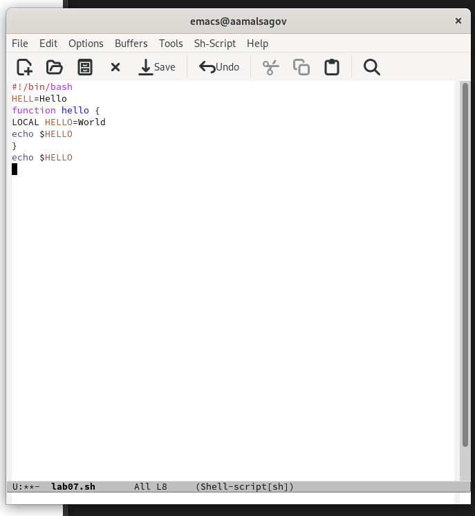
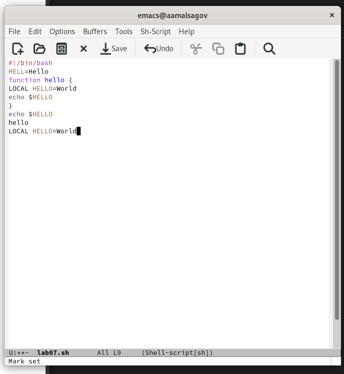
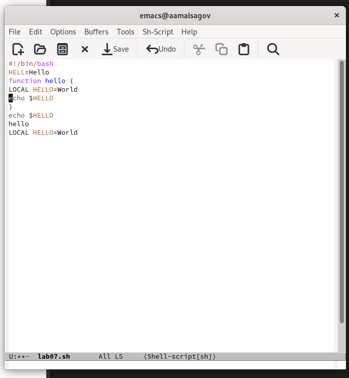
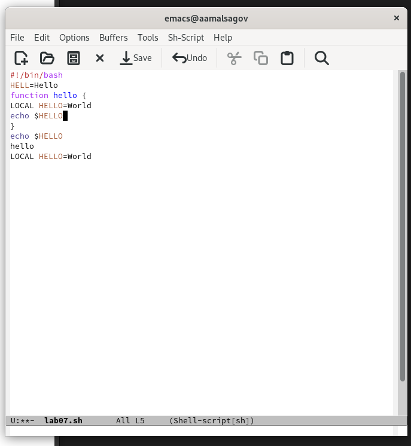
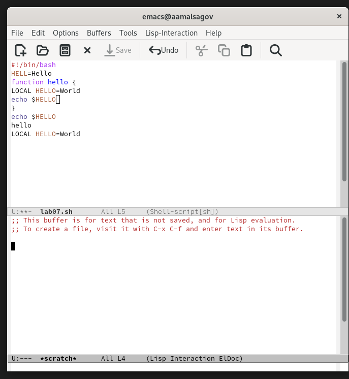
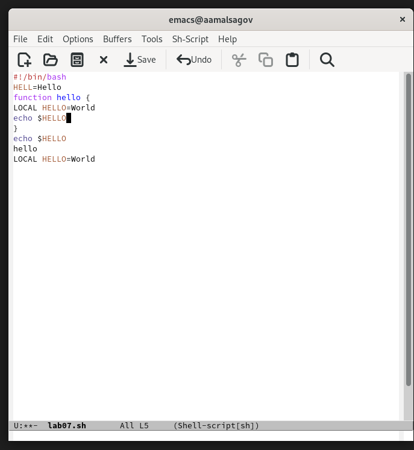
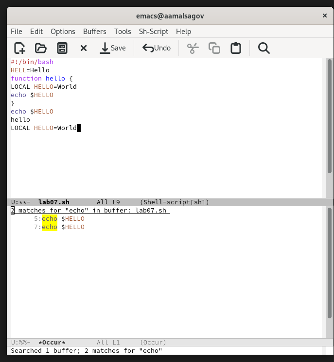

---
## Front matter
lang: ru-RU
title: "Текстовой редактор emacs"
author: Мальсагов М.А.
institute:
date: 

## Formatting
mainfont: PT Serif
romanfont: PT Serif
sansfont: PT Sans
monofont: PT Mono
toc: false
slide_level: 2
theme: metropolis
header-includes: 
 - \metroset{progressbar=frametitle,sectionpage=progressbar,numbering=fraction}
 - '\makeatletter'
 - '\beamer@ignorenonframefalse'
 - '\makeatother'
aspectratio: 43
section-titles: true

---

## Цель работы

Познакомиться с операционной системой Linux. Получить практические навыки работы с редактором Emacs.

---

## Выполнение лабораторной работы

1. Открыл emacs, создал lab07.sh и вставил текст.(рис. [-@fig:001])

{ #fig:001 width=70% }

---

## Выполнение лабораторной работы

2. Вырезал последнюю строку. (рис. [-@fig:002])

{ #fig:002 width=70% }

---

## Выполнение лабораторной работы

3. Отменил последнее действие.(рис. [-@fig:003])

{ #fig:003 width=70% }

---

## Выполнение лабораторной работы

4. Вырезал строку.(рис. [-@fig:004])

{ #fig:004 width=70% }

---

## Выполнение лабораторной работы

5. Отменил последнее действие.(рис. [-@fig:005])

{ #fig:005 width=70% }

---

## Выполнение лабораторной работы

6. Переместил курсор в начало строки. (рис. [-@fig:006])

{ #fig:006 width=70% }

---

## Выполнение лабораторной работы

7. Переместите курсор в конец строки.(рис. [-@fig:007])

{ #fig:007 width=70% }

---

## Выполнение лабораторной работы

8. Переместил курсор в начало буфера.(рис. [-@fig:008])

{ #fig:008 width=70% }

---

## Выполнение лабораторной работы

9. Переместил курсор в конец буфера.(рис. [-@fig:009])

{ #fig:009 width=70% }

---

## Выполнение лабораторной работы

10. Вывел список активных буферов на экран.(рис. [-@fig:010])

{ #fig:010 width=70% }

---

## Выполнение лабораторной работы

11. Закрыл это окно.(рис. [-@fig:011])

{ #fig:011 width=70% }

---

## Выполнение лабораторной работы

12. Вновь переключился между буферами, но уже без вывода их списка на экран. (рис. [-@fig:012])

{ #fig:012 width=70% }

---

## Выполнение лабораторной работы

13. Поделил фрейм на 4 части: разделил фрейм на два окна по вертикали,
а затем каждое из этих окон на две части по горизонтали. В каждом из четырёх созданных окон открыл новый буфер (файл) и ввел несколько строк текста. (рис. [-@fig:013])

{ #fig:013 width=70% }

---

## Выполнение лабораторной работы

14. Переключился в режим поиска и нашел слово echo.Переключился между результатами поиска(рис. [-@fig:014])

{ #fig:014 width=70% }

---

## Выполнение лабораторной работы

15. Испробовал другой режим поиска.(рис. [-@fig:015])

{ #fig:015 width=70% }

---

## Выводы

Мы получили базовые навыки использования emacs.
