---
## Front matter
title: "Отчёт по лабораторной работе №5"
subtitle: "Анализ файловой структуры UNIX. Команды для работы с файлами и каталогами"
author: "Мальсагов Акрамат Абу-Бакарович"

## Generic otions
lang: ru-RU
toc-title: "Содержание"

## Bibliography
bibliography: bib/cite.bib
csl: pandoc/csl/gost-r-7-0-5-2008-numeric.csl

## Pdf output format
toc: true # Table of contents
toc-depth: 2
lof: true # List of figures
lot: true # List of tables
fontsize: 12pt
linestretch: 1.5
papersize: a4
documentclass: scrreprt
## I18n polyglossia
polyglossia-lang:
  name: russian
  options:
	- spelling=modern
	- babelshorthands=true
polyglossia-otherlangs:
  name: english
## I18n babel
babel-lang: russian
babel-otherlangs: english
## Fonts
mainfont: PT Serif
romanfont: PT Serif
sansfont: PT Sans
monofont: PT Mono
mainfontoptions: Ligatures=TeX
romanfontoptions: Ligatures=TeX
sansfontoptions: Ligatures=TeX,Scale=MatchLowercase
monofontoptions: Scale=MatchLowercase,Scale=0.9
## Biblatex
biblatex: true
biblio-style: "gost-numeric"
biblatexoptions:
  - parentracker=true
  - backend=biber
  - hyperref=auto
  - language=auto
  - autolang=other*
  - citestyle=gost-numeric
## Pandoc-crossref LaTeX customization
figureTitle: "Рис."
tableTitle: "Таблица"
listingTitle: "Листинг"
lofTitle: "Список иллюстраций"
lotTitle: "Список таблиц"
lolTitle: "Листинги"
## Misc options
indent: true
header-includes:
  - \usepackage{indentfirst}
  - \usepackage{float} # keep figures where there are in the text
  - \floatplacement{figure}{H} # keep figures where there are in the text
---

# Цель работы

Ознакомление с файловой системой Linux, её структурой, именами и содержаниемкаталогов. Приобретение практических навыков по применению команд для работыс файлами и каталогами,по управлению процессами (и работами),по проверке использования диска и обслуживанию файловой системы.

# Задания

   1. Выполните все примеры, приведённые в первой части описания лабораторной работы.
   2. Выполните следующие действия, зафиксировав в отчёте по лабораторной работе используемые при этом команды и результаты их выполнения:

   - Скопируйте файл /usr/include/sys/io.h в домашний каталог и назовите его equipment. Если файла io.h нет, то используйте любой другой файл в каталоге /usr/include/sys/ вместо него.
   - В домашнем каталоге создайте директорию ~/ski.plases.
   - Переместите файл equipment в каталог ~/ski.plases.
   - Переименуйте файл /ski.plases/equipment в /ski.plases/equiplist.
   - Создайте в домашнем каталоге файл abc1 и скопируйте его в каталог ~/ski.plases, назовите его equiplist2.
   - Создайте каталог с именем equipment в каталоге ~/ski.plases.
   - Переместите файлы ~/ski.plases/equiplist и equiplist2 в каталог ~/ski.plases/equipment.
   - Создайте и переместите каталог /newdir в каталог /ski.plases и назовите его plans.

   3. Определите опции команды chmod, необходимые для того, чтобы присвоить перечисленным ниже файлам выделенные права доступа, считая, что в начале таких прав нет:

   - drwxr--r-- ... australia
   - drwx--x--x ... play
   - -r-xr--r-- ... my_os
   - -rw-rw-r-- ... feathers При необходимости создайте нужные файлы.

   4. Проделайте приведённые ниже упражнения, записывая в отчёт по лабораторной работе используемые при этом команды:

   - Просмотрите содержимое файла /etc/password.
   - Скопируйте файл /feathers в файл /file.old.
   - Переместите файл /file.old в каталог /play.
   - Скопируйте каталог /play в каталог /fun.
   - Переместите каталог /fun в каталог /play и назовите его games.
   - Лишите владельца файла /feathers права на чтение.
   - Что произойдёт, если вы попытаетесь просмотреть файл /feathers командой cat?
   - Что произойдёт, если вы попытаетесь скопировать файл /feathers?
   - Дайте владельцу файла /feathers право на чтение.
   - Лишите владельца каталога /play права на выполнение.
   - Перейдите в каталог /play. Что произошло?
   - Дайте владельцу каталога /play право на выполнение.

   5. Прочитайте man по командам mount, fsck, mkfs, kill и кратко их охарактеризуйте, приведя примеры.

# Выполнение лабораторной работы

   **1.** Выполнил все примеры, приведенные в первой части описания лабораторной работы.(рис. [-@fig:001;-@fig:002;-@fig:003;-@fig:004;-@fig:005;-@fig:006;-@fig:007;-@fig:008;-@fig:009;-@fig:010])

   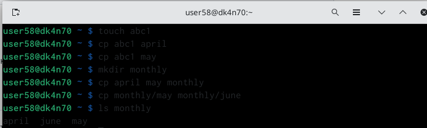{ #fig:001 width=70% }

   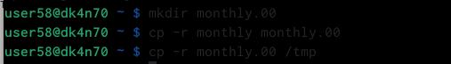{ #fig:002 width=70% }

   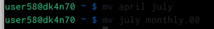{ #fig:003 width=70% }

   { #fig:004 width=70% }

   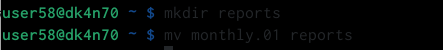{ #fig:005 width=70% }

   { #fig:006 width=70% }

   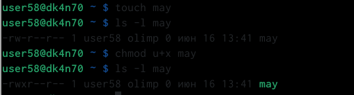{ #fig:007 width=70% }

   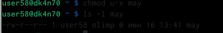{ #fig:008 width=70% }

   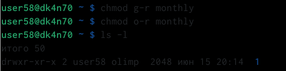{ #fig:009 width=70% }

   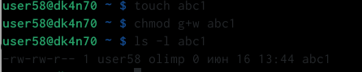{ #fig:0010 width=70% }

   **2.** Скопировал файл /usr/include/sys/io.h в домашний каталог и назвал его equipment.(рис. [-@fig:011])

   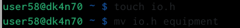{ #fig:0011 width=70% }
   
   **3.** В домашнем каталоге создал директорию ~/ski.plases.(рис. [-@fig:012])
   
   { #fig:0012 width=70% }
   
   **4.** Переместил файл equipment в каталог ~/ski.plases и переименовал его в equiplist2.(рис. [-@fig:013])
   
   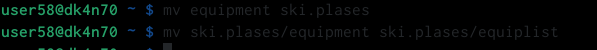{ #fig:0013 width=70% }
   
   **5.** Создал в домашнем каталоге файл abc1, скопировал его в каталог ~/ski.plases и назвал его equiplist2.(рис. [-@fig:014])
   
   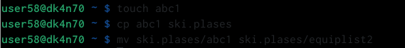{ #fig:0014 width=70% }
   
   **6.** Создал каталог с именем equipment в каталоге /ski.plases. Переместил файлы /ski.plases/equiplist и equiplist2 в каталог /ski.plases/equipment.(рис. [-@fig:015])
   
   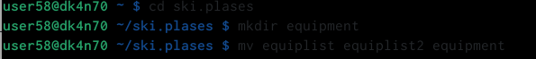{ #fig:0015 width=70% }
   
   **7.** Создал и переместил каталог /newdir в каталог /ski.plases и назвал его plans.(рис. [-@fig:016])
   
   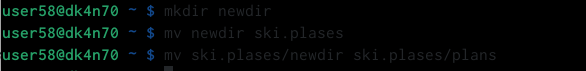{ #fig:0016 width=70% }
   
   **8.** Создал необходимые файлы и каталоги.(рис. [-@fig:017;-@fig:018])
   
   { #fig:0017 width=70% }
   
   { #fig:0018 width=70% }
   
   **9.** Присвоил каталогам и файлам права, указанные в задании.(рис. [-@fig:019])
   
   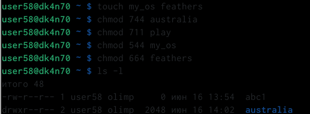{ #fig:0019 width=70% }
   
   **10.** Просмотрел содержимое файла /etc/passwd с помощью *cat*.(рис. [-@fig:020])
   
   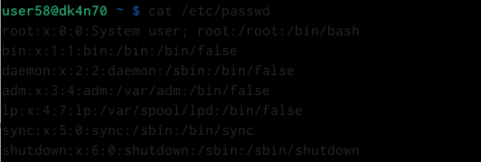{ #fig:0020 width=70% }
   
   **11.** Скопировал файл /feathers в файл /file.old и переместил file.old в каталог /play. (рис. [-@fig:021])
   
   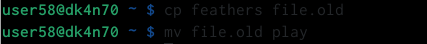{ #fig:0021 width=70% }
   
   **12.** Скопировал каталог /play в каталог /fun.(рис. [-@fig:022])
   
   { #fig:0022 width=70% }
   
   **13.** Переместил каталог /fun в каталог /play и переименовал его games, однако он почему-то оказался в домашнем каталоге. Тогда я просто переместил его в play.(рис. [-@fig:023])
   
   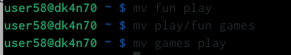{ #fig:0023 width=70% }
   
   **14.** Лишил владельца файла ~/feathers права на чтение, попытался его прочитать, но ничего не произошло. Затем я вернул право на чтение владельцу.(рис. [-@fig:024])
   
   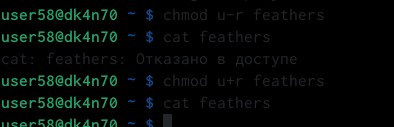{ #fig:0024 width=70% }
   
   **15.** Лишил владельца каталога /play права на выполнение и попробовал перейти в него(удачно).(рис. [-@fig:025])
   
   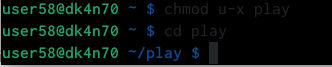{ #fig:0025 width=70% }
   
   **16.** Вернул владельцу право на выполнение каталога *play*. (рис. [-@fig:026])
   
   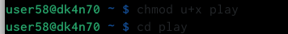{ #fig:0026 width=70% }
   
   **17.** Прочитал man по командам mount, fsck, mkfs, kill(в скринкасте охаратеризовал их).(рис. [-@fig:027;-@fig:028;-@fig:029;-@fig:030;])
   
   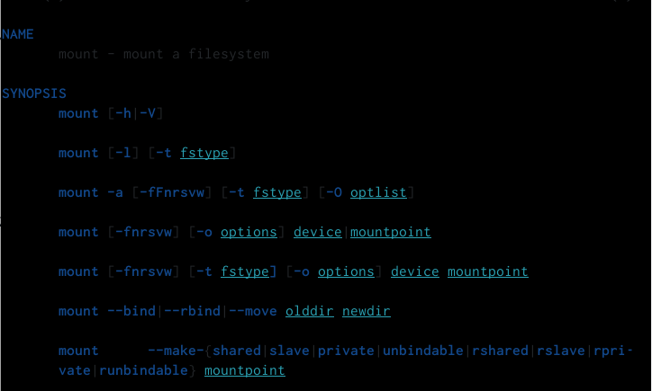{ #fig:0027 width=70% }
   
   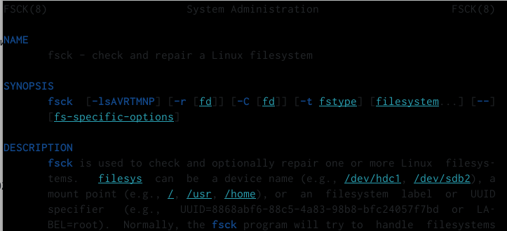{ #fig:0028 width=70% }
   
   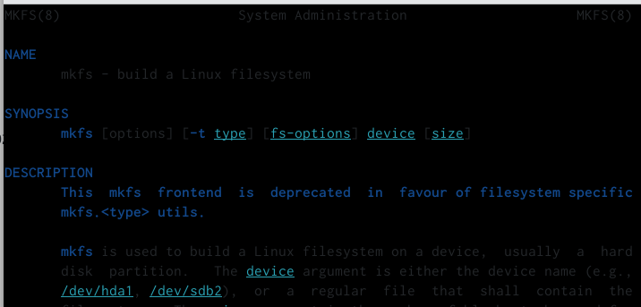{ #fig:0029 width=70% }
   
   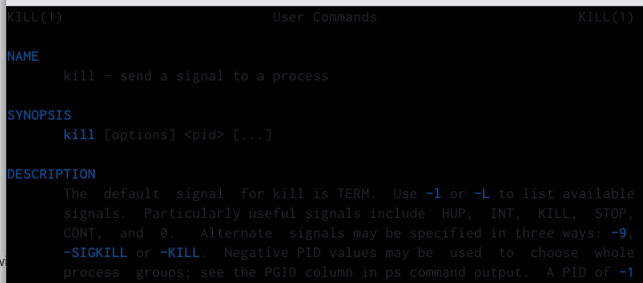{ #fig:0030 width=70% }
   

# Выводы

Я приобрел практические навыки по применению команд для работы с файлами и каталогами, по управлению процессами (и работами), по проверке использования диска и обслуживанию файловой системы.

